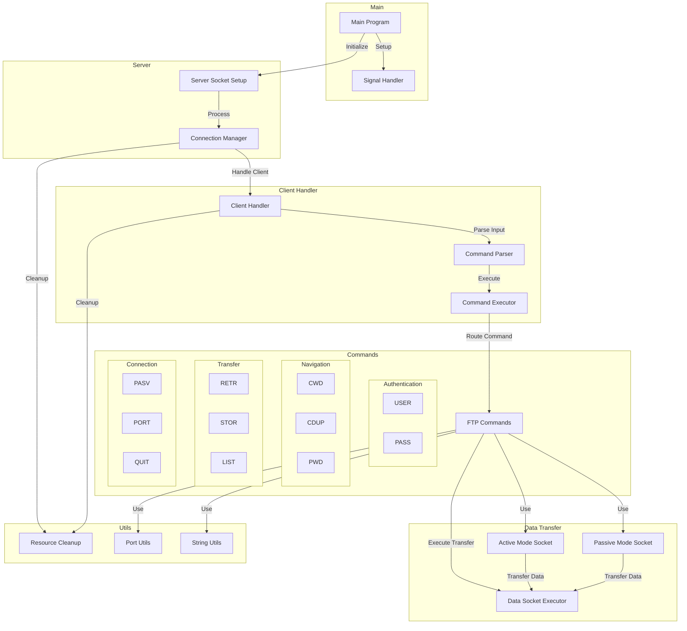

# MyFTP Architecture

## Components Overview

This diagram shows the main components of the FTP server and their interactions.

## Components Description

### Main Program
- Entry point of the application
- Handles server initialization and signal setup

### Server
- Manages socket configuration
- Handles client connections

### Client Handler
- Manages client communication
- Implements FTP protocol logic
- Parses and executes client commands

### Data Transfer
- Handles file transfers in both active and passive modes
- Manages data socket connections
- Provides data streaming capabilities

### Commands
- Implements standard FTP commands
- Handles authentication, navigation, and file operations
- Manages connection state changes

### Utils
- Provides helper functions for string manipulation
- Handles port calculations and socket operations
- Manages proper resource cleanup
