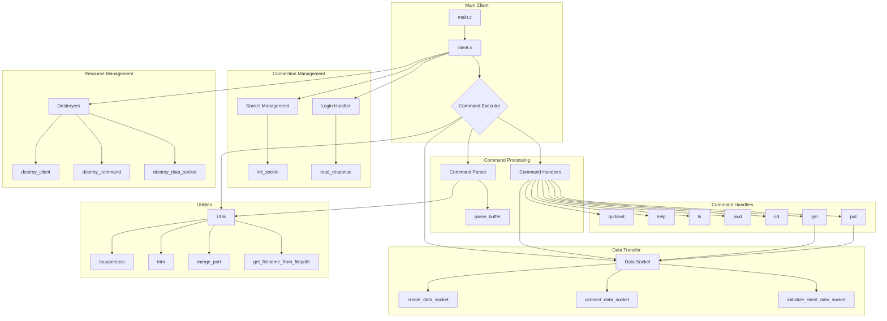

# MyFTP Client

## Overview
MyFTP Client is a command-line FTP client implementation that complements the MyFTP server. It provides a simple interface to interact with FTP servers while supporting essential FTP commands.

## Features
- Command-line interface
- Support for passive mode
- File upload and download capabilities
- Directory navigation and listing
- Interactive shell mode

## Build Instructions
The project is built using a Makefile. You can compile the client using the following commands:
- `make` - Compile the project.
- `make re` - Recompile the project.
- `make clean` - Remove intermediate files.
- `make fclean` - Remove all generated files, including the binary.

## Usage
Launch the client using:
```bash
./myftp_client [HOST] [PORT]
```
### Examples
```bash
# Connect to local server
./myftp_client 127.0.0.1 4242
```

## Interactive Commands
Once connected, the following commands are available:

| Command | Description | Usage |
|---------|-------------|-------|
| `ls`    | List files  | `ls [path]` |
| `cd`    | Change directory | `cd <path>` |
| `get`   | Download file | `get <remote_file> [local_file]` |
| `put`   | Upload file | `put <local_file> [remote_file]` |
| `pwd`   | Print working directory | `pwd` |
| `help`  | Show help | `help [command]` |
| `quit`  | Exit client | `quit` |
| `exit`  | Exit client | `exit` |

## Examples

### Basic Usage
```bash
# Start client
$ ./myftp_client localhost 4242

# Login
Username: anonymous
Password:

# List files
> ls
> pwd

# Download file
> get remote_file.txt

# Upload file
> put local_file.txt

# Exit
> quit
```

## Architecture

This diagram illustrates the architecture of the MyFTP client:


